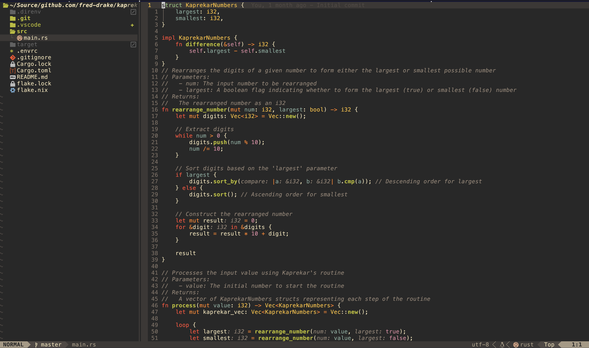

# My Personal Neovim Setup

My Nix-based Neovim configuration built with [NixVim](https://github.com/nix-community/nixvim). All configuration is written in Nix, with inline Lua where needed. Every output is a standalone Neovim binary with plugins, LSP servers, formatters, and tools bundled via Nix.

Forked from [fred-drake/neovim](https://github.com/fred-drake/neovim).



## Usage

Option 1: Clone and run

```bash
git clone https://github.com/Aneurysm9/neovim.git
nix run .#
```

Option 2: Run directly

```bash
nix run github:Aneurysm9/neovim#
```

### Configurations

The default configuration includes LSP, completion, formatting, debugging, and tooling for general-purpose editing (Nix, JSON, YAML, Markdown, TOML, and more). Language-specific configurations layer additional LSP servers, formatters, and DAP adapters on top of the default:

- Rust `nix run github:Aneurysm9/neovim#rust`
- C# `nix run github:Aneurysm9/neovim#csharp`
- Go `nix run github:Aneurysm9/neovim#golang`
- Python `nix run github:Aneurysm9/neovim#python`
- Javascript `nix run github:Aneurysm9/neovim#javascript`

A minimal configuration is also available that strips out all language tooling (LSP, formatters, completion, DAP, database client, AI agent) for a lightweight editor with treesitter highlighting, file navigation, fuzzy finding, and git integration:

- Minimal `nix run github:Aneurysm9/neovim#minimal`

### Install Multiple Configurations

You can have multiple neovim configurations (`nvim`, `nvim-rust`, `nvim-golang`, etc). Here's the gist:

Create a function that creates neovim links with unique configuration names:

```nix
    mkNeovimPackages = pkgs: neovimPkgs: let
      mkNeovimAlias = name: pkg:
        pkgs.runCommand "neovim-${name}" {} ''
          mkdir -p $out/bin
          ln -s ${pkg}/bin/nvim $out/bin/nvim-${name}
        '';
```

And add it to your home-manager imports:

```nix
    ({pkgs, ...}: {
      home.packages =
        (builtins.attrValues (mkNeovimPackages pkgs inputs.neovim.packages.${pkgs.system}))
        ++ [inputs.neovim.packages.${pkgs.system}.default];
    })
```

## Architecture

All configuration lives in `config/`. The base config (`config/default.nix`) auto-imports every `.nix` file in the directory, so adding a new file automatically includes it in the build. Language subdirectories (`config/rust/`, `config/python/`, etc.) use the same pattern but are only pulled in by `flake.nix` for their respective outputs.

The minimal build (`config/minimal/`) is an independent entry point that cherry-picks shared config files (`options.nix`, `themes.nix`, `find.nix`) and provides its own stripped-down plugin and keymap definitions.

Key config files:

| File | What it configures |
|---|---|
| `config/options.nix` | Core editor options (tabs, clipboard, search, undo) |
| `config/themes.nix` | Colorscheme (onedark) |
| `config/sets.nix` | Plugin enablement (treesitter, gitsigns, nvim-tree, bufferline, lualine, etc.) |
| `config/keys.nix` | All keymaps via which-key groups |
| `config/language.nix` | nvim-cmp completion, base LSP servers, conform-nvim formatters, diagnostics |
| `config/debugging.nix` | DAP base setup, breakpoint signs, UI listeners |
| `config/find.nix` | FZF-Lua and Telescope configuration |
| `config/dashboard.nix` | Alpha startup dashboard |
| `config/plugins.nix` | Extra plugins (vim-dadbod for databases) |
| `config/agentic.nix` | AI chat sidebar (agentic.nvim) |
| `config/transparent.nix` | Background transparency for terminal |

## Technology Support

| Technology | Formatter | Language Server | Debugger | Configuration |
|---|---|---|---|---|
| Nix | alejandra | nil-ls, nixd | | default |
| Just | just | | | default |
| SQL | sqlformat | | | default |
| Lua | stylua | | | default |
| YAML | yamlfmt | yamlls | | default |
| CSS | prettier | | | default |
| HTML | prettier | | | default |
| JSON | prettier | jsonls | | default |
| Markdown | prettier | marksman | | default |
| Ruby | rubyfmt | | | default |
| Terraform | tofu_fmt | | | default |
| TOML | | taplo | | default |
| HCL | hclfmt | | | default |
| C# | csharpier* | | netcoredbg | csharp |
| Go | golines | gopls | delve | golang |
| Python | black | pylsp | dap-python | python |
| Rust | rustfmt | rust-analyzer (via rustaceanvim) | lldb | rust |
| JS/TS | prettier | ts_ls, eslint | vscode-js-debug | javascript |

\* csharpier runs as a `BufWritePost` autocmd rather than through conform-nvim due to .NET SDK version conflicts.

## Validation

```bash
# Validate configuration integrity
nix flake check .

# Update flake dependencies
nix flake update
```
